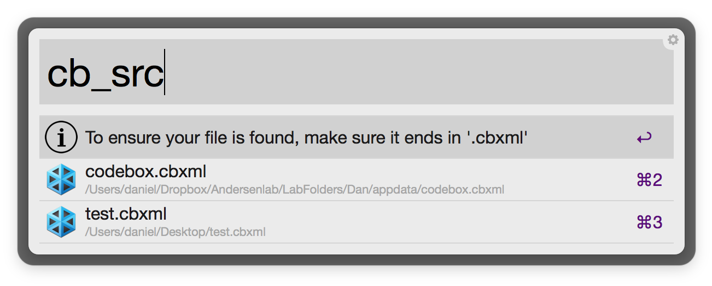
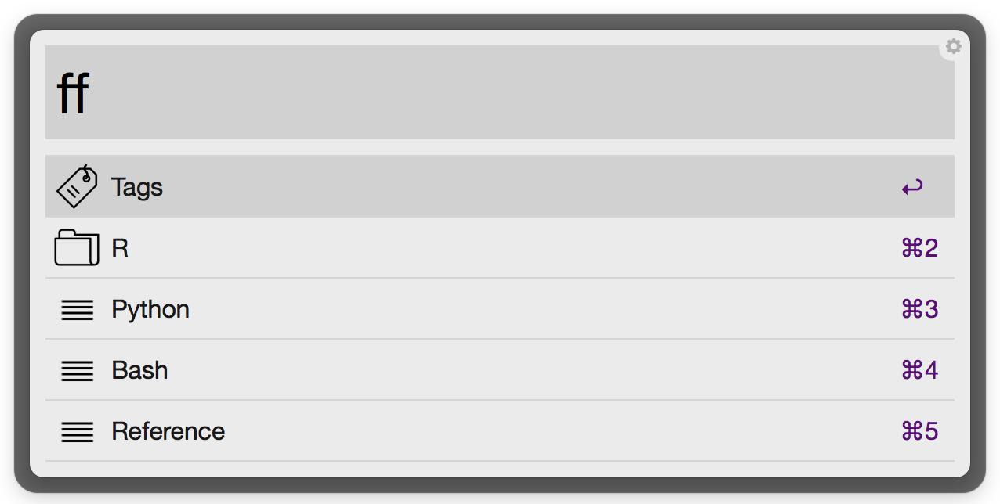
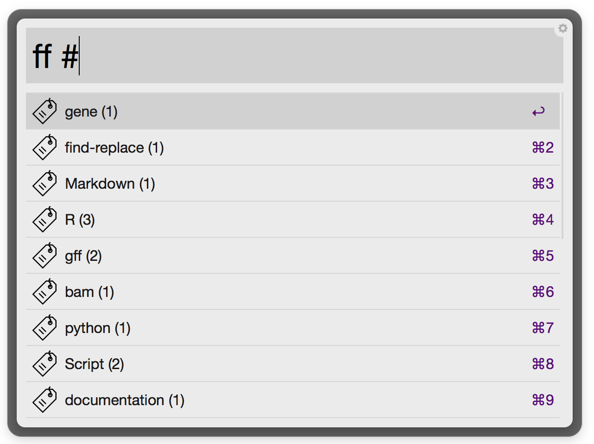
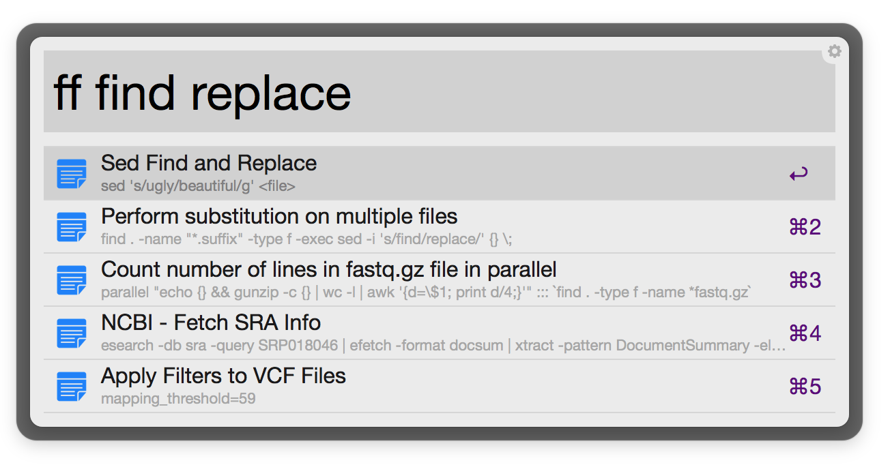

# codebox-alfred

An alfred workflow for accessing codebox snippets.

### [Download the latest version](https://github.com/danielecook/codebox-alfred/releases)

## Important!

The workflow works fairly well, but there are a few caveats. You should not do the following with your codebox libraries:

* Don't put spaces into tag, list, or folder names. Use an underscore instead. I could have allowed spaces, but it would have made the alfred commands a lot messier (folders, tags, and lists would have to of been quoted). 
* Don't nest folders/lists with the same name. 

## Usage

__Set the codebox source using `cb_src`__

__Invoke the workflow by typing `ff`__

__Browse tags with `ff #<search>`__

__Search all Snippets: `ff <search>`__

